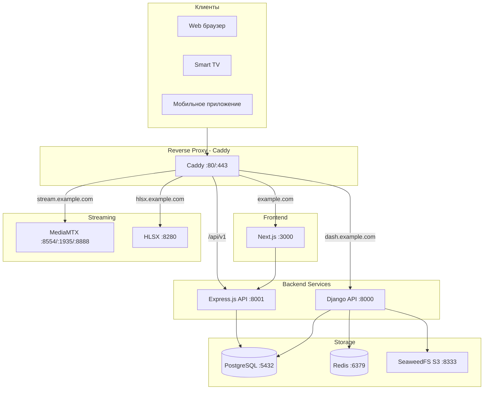
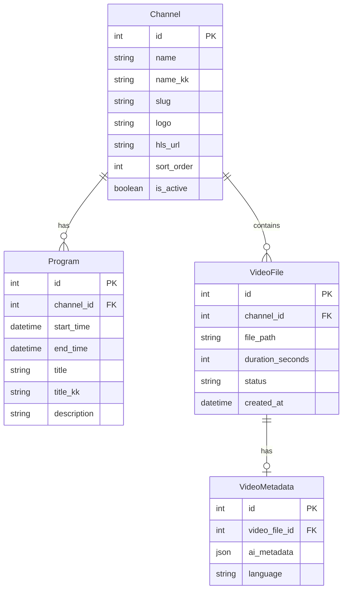
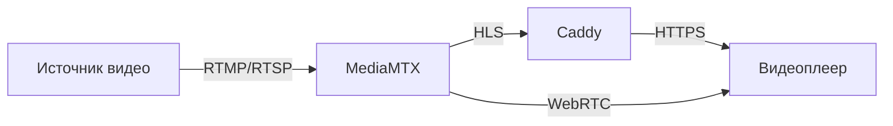

# 🏗️ Архитектура Adapto Digital TV

Adapto Digital TV — это платформа для управления телевизионным контентом и стримингом, построенная на микросервисной архитектуре.

## 📊 Общая схема



---

## 🌐 Домены и маршрутизация

| Домен | Сервис | Назначение |
|-------|--------|------------|
| `example.com` | Next.js (frontend) | Основной сайт для зрителей |
| `example.com/api/v1/*` | Express.js (back-express) | Быстрый API для фронтенда |
| `example.com/admin/django/*` | Django (backend) | Django Admin |
| `dash.example.com` | Django (backend) | API и администрирование |
| `stream.example.com` | MediaMTX | HLS/RTSP/WebRTC стриминг |
| `hlsx.example.com` | HLSX | HLS прокси-сервер |

---

## 📦 Приложения (apps/)

### 🐍 apps/back — Django Backend

**Технологии**: Django 4.x, Django REST Framework, PostgreSQL, Gunicorn

**Назначение**:
- REST API для управления контентом
- Django Admin для администраторов
- Миграции базы данных
- AI-обработка метаданных видео

**Структура**:
```
apps/back/
├── adapto_back/          # Основные настройки Django
│   ├── settings.py      # Конфигурация
│   ├── urls.py          # Маршруты
│   └── admin.py         # Кастомизация админки
├── tvchannels/          # Приложение ТВ-каналов
│   ├── models.py        # Модели: Channel, Program, VideoFile
│   ├── views.py         # API views
│   ├── serializers.py   # DRF сериализаторы
│   └── admin.py         # Админка каналов
├── ai_metadata/         # AI-обработка метаданных
│   ├── models.py        # AIProvider, AITask
│   └── services.py      # Сервисы обработки
├── injest/              # Импорт видеофайлов
│   ├── models.py        # InjestJob
│   └── ffmpeg_service.py # FFmpeg интеграция
└── manage.py
```

**Основные модели**:
- `Channel` — ТВ-канал (название, slug, лого, HLS URL)
- `Program` — Программа в расписании (время, название, описание)
- `VideoFile` — Видеофайл (путь, метаданные, статус)

---

### ⚡ apps/back.js — Express.js Backend

**Технологии**: Express.js, pg (PostgreSQL), Node.js

**Назначение**:
- Легковесный API без ORM для высоконагруженных запросов
- Быстрая выдача расписания и списка каналов
- Прямые SQL-запросы для максимальной производительности

**Структура**:
```
apps/back.js/
├── src/
│   ├── index.js           # Точка входа
│   ├── controllers/       # Контроллеры
│   │   ├── channelsController.js
│   │   └── programsController.js
│   ├── routes/            # Маршруты API
│   │   ├── channels.js
│   │   └── programs.js
│   └── db/
│       └── database.js    # Пул подключений PostgreSQL
└── Dockerfile
```

**API эндпоинты**:
- `GET /api/v1/channels/` — Список каналов
- `GET /api/v1/programs/` — Расписание программ
- `GET /api/v1/programs/:channelId/:date` — Расписание канала на дату

---

### 🎨 apps/front — Next.js Frontend

**Технологии**: Next.js 15, React 19, TypeScript, Tailwind CSS, Shadcn/UI

**Назначение**:
- Основной веб-сайт для зрителей
- Админ-панель для редакторов контента
- HLS видеоплеер
- Мультиязычность (казахский, русский)

**Структура**:
```
apps/front/src/
├── app/
│   ├── page.tsx                    # Главная страница
│   ├── [channelSlug]/              # Страницы каналов
│   │   ├── page.tsx                # Страница канала
│   │   ├── embed/page.tsx          # Embed плеер
│   │   └── schedule/               # Расписание
│   ├── admin/                      # Админ-панель
│   │   ├── layout.tsx              # Layout админки
│   │   ├── page.tsx                # Dashboard
│   │   ├── [channel]/              # Управление каналом
│   │   │   ├── content/page.tsx    # Контент канала
│   │   │   └── schedule/page.tsx   # Расписание канала
│   │   └── schedule/page.tsx       # Общее расписание
│   └── schedule/page.tsx           # Расписание всех каналов
├── components/
│   ├── HLSPlayer.tsx               # HLS видеоплеер
│   ├── ChannelCard.tsx             # Карточка канала
│   ├── ScheduleAccordion.tsx       # Аккордеон расписания
│   ├── admin/                      # Компоненты админки
│   │   ├── AdminTopBar.tsx
│   │   └── AdminChannelSwitcher.tsx
│   └── ui/                         # Shadcn/UI компоненты
└── services/
    └── api.ts                      # API клиент
```

---

### 📺 apps/smarttv — Smart TV приложения

**Технологии**: React, TypeScript, Yarn Workspaces

**Платформы**: Samsung Tizen, LG webOS, Android TV, Apple tvOS

**Структура**:
```
apps/smarttv/
├── packages/
│   ├── app-core/           # Общая логика приложения
│   ├── renderer-web/       # Web версия (для разработки)
│   └── renderer-rn-tv/     # React Native TV рендерер
└── yarn.lock
```

---

### 📱 apps/mobapp — Мобильное приложение

**Технологии**: React Native, Expo, TypeScript

**Платформы**: iOS, Android, Web

**Структура**:
```
apps/mobapp/
├── app/
│   ├── _layout.tsx         # Root layout
│   ├── (tabs)/             # Tab navigation
│   └── channel/[id].tsx    # Страница канала
├── components/
│   ├── ChannelCard.tsx
│   ├── HLSVideoPlayer.web.tsx
│   └── ScheduleProgram.tsx
└── services/
    └── adapto-api.ts        # API клиент
```

---

### 🎬 apps/hlsx — HLS прокси-сервер

**Технологии**: Go

**Назначение**: Прокси для HLS потоков с дополнительной обработкой

---

## 🛠️ Инструменты (tools/)

### Парсеры контента

| Инструмент | Назначение |
|------------|------------|
| `parse_from_altyn_qor_com/` | Парсинг с altyn-qor.com |
| `parse_from_dalet_ftp/` | Парсинг с Dalet FTP |

### Обработка медиа

| Инструмент | Назначение |
|------------|------------|
| `normalize/` | Нормализация аудио/видео (Python, FFmpeg) |
| `virtual-normalize/` | Виртуальная нормализация без перекодирования |
| `scan_and_transcode_x/` | Сканирование и транскодирование (Go) |
| `transcode-timetable-items/` | Транскодирование элементов расписания |

### Генерация расписания

| Инструмент | Назначение |
|------------|------------|
| `timetable-generate/` | Генератор расписания (Go) |
| `timetable-generate.js/` | Генератор расписания (Node.js) |
| `timetable-humanize/` | Гуманизация расписания с OpenAI |

### Плейаут и мониторинг

| Инструмент | Назначение |
|------------|------------|
| `ffplayout/` | FFmpeg-based playout engine (Rust) |
| `check-ffplayout/` | Проверка статуса ffplayout |

### Утилиты

| Инструмент | Назначение |
|------------|------------|
| `copy_from_folders/` | Синхронизация папок |
| `move-files/` | Перемещение файлов (Go) |
| `filebrowserx/` | Файловый браузер с транскодированием |

---

## 🐳 Docker сервисы

### Основные сервисы (docker-compose.yml)

| Сервис | Образ | Порты | Назначение |
|--------|-------|-------|------------|
| `caddy` | caddy:2 | 80, 443 | Reverse proxy, SSL |
| `backend` | apps/back | 8000 | Django API |
| `back-express` | apps/back.js | 8001 | Express.js API |
| `frontend` | apps/front | 3000 | Next.js |
| `postgres` | postgres:15 | 5432 | База данных |
| `redis` | redis:7 | 6379 | Кэш и сессии |
| `mediamtx` | bluenviron/mediamtx | 8554, 1935, 8888, 8889 | Стриминг |
| `hlsx` | apps/hlsx | 8280 | HLS прокси |

### Дополнительные файлы конфигурации

| Файл | Назначение |
|------|------------|
| `docker-compose.ffplayout.yml` | FFplayout сервисы |
| `docker-compose.timetable.yml` | Генерация расписания |
| `docker-compose.tools.yml` | Инструменты обработки |

---

## 🗄️ База данных

### Основные таблицы



---

## 🔐 Безопасность

### Аутентификация
- Django Session Auth для админ-панели
- JWT токены для API (опционально)

### CORS
- Настраивается через `CORS_ALLOWED_ORIGINS` в `.env`

### CSRF
- Django CSRF защита для форм
- `CSRF_TRUSTED_ORIGINS` для внешних доменов

### Reverse Proxy
- Caddy обрабатывает SSL/TLS
- Заголовки `X-Forwarded-*` для Django

---

## 📡 Стриминг

### Протоколы MediaMTX

| Протокол | Порт | URL формат |
|----------|------|------------|
| RTSP | 8554 | `rtsp://host:8554/stream` |
| RTMP | 1935 | `rtmp://host:1935/stream` |
| HLS | 8888 | `http://host:8888/stream/index.m3u8` |
| WebRTC | 8889 | `https://host:8889/stream` |

### Поток данных



---

## 📁 Файловая структура проекта

```
adapto/
├── apps/
│   ├── back/              # Django backend
│   ├── back.js/           # Express.js backend
│   ├── front/             # Next.js frontend
│   ├── hlsx/              # HLS прокси
│   ├── smarttv/           # Smart TV приложения
│   └── mobapp/            # Мобильное приложение
├── tools/                 # Утилиты и скрипты
├── docs/                  # Документация
├── scripts/               # SQL скрипты
├── media/                 # Медиафайлы (gitignore)
│   └── hls/               # HLS сегменты
├── storage/               # SeaweedFS данные (gitignore)
├── docker-compose.yml     # Основной compose файл
├── Caddyfile              # Конфигурация Caddy
├── mediamtx.yml           # Конфигурация MediaMTX
├── Makefile               # Команды Make
├── env.example            # Пример .env файла
└── README.md              # Главный README
```

---

## 🔗 Связанные документы

- [Быстрый старт](../setup/QUICK_START.md)
- [Настройка окружения](../setup/ENVIRONMENT.md)
- [Docker и развёртывание](../setup/DOCKER.md)
- [Стриминг](../guides/STREAMING.md)
- [Хранилище](../guides/STORAGE.md)
