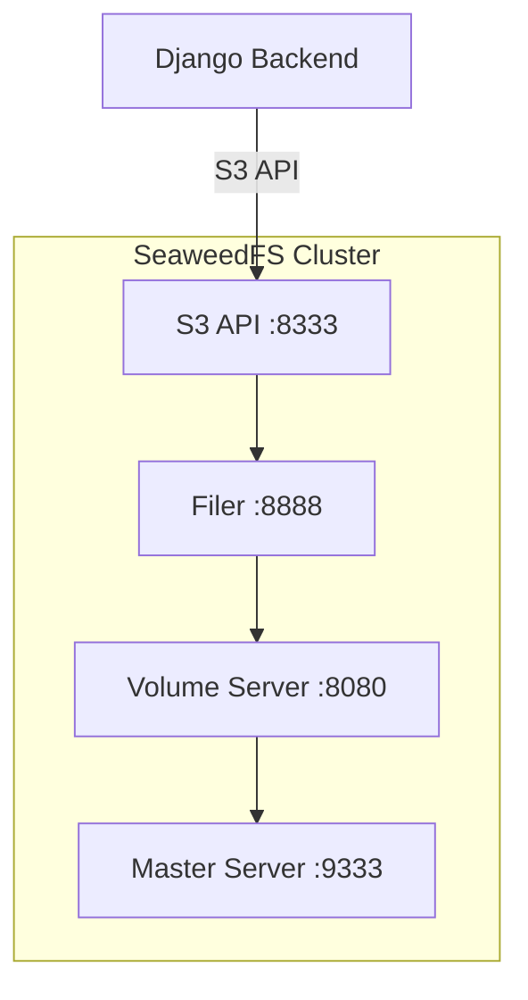

# 🪣 Объектное хранилище (SeaweedFS)

Руководство по настройке и использованию SeaweedFS — S3-совместимого объектного хранилища для Adapto Digital TV.

## 📋 Обзор

SeaweedFS — это масштабируемая распределённая файловая система с поддержкой S3 API.

### Преимущества

- **S3 совместимость**: Работает с AWS SDK, AWS CLI, Django-storages
- **Масштабируемость**: Легко добавлять новые volume servers
- **Эффективность**: Автоматическая дедупликация и сжатие
- **Производительность**: Оптимизирован для медиафайлов

---

## 🏗️ Архитектура



### Компоненты

| Компонент | Порт | Назначение |
|-----------|------|------------|
| **Master** | 9333 | Координация и управление метаданными |
| **Volume** | 8080 | Хранение файлов |
| **Filer** | 8888 | Файловая система, web UI |
| **S3 API** | 8333 | S3-совместимый REST API |

---

## 🚀 Быстрый старт

### 1. Создание директорий

```bash
make docker-setup
# или вручную:
mkdir -p storage/seaweedfs/master storage/seaweedfs/volume storage/seaweedfs/filer
```

### 2. Запуск

SeaweedFS запускается вместе с основным стеком:

```bash
docker compose up -d
```

### 3. Проверка работы

```bash
# Статус кластера
curl http://localhost:9333/cluster/status

# Volume server
curl http://localhost:8080/status

# Filer
curl http://localhost:8888/

# S3 API
curl http://localhost:8333/
```

### 4. Настройка Django

```bash
# Создание S3 бакетов
docker compose exec backend python manage.py setup_seaweedfs
```

---

## 📂 Структура хранилища

```
storage/seaweedfs/
├── master/          # Метаданные координатора
├── volume/          # Файлы и данные
└── filer/           # Файловая система

# Бакеты (создаются автоматически)
adapto-media          # Основные медиафайлы
adapto-media-videos   # Видео
adapto-media-images   # Изображения
adapto-media-thumbnails # Миниатюры
adapto-media-temp     # Временные файлы
```

---

## 🔧 Конфигурация

### Переменные окружения

```bash
# .env
SEAWEEDFS_S3_ACCESS_KEY=adapto-access-key-123
SEAWEEDFS_S3_SECRET_KEY=adapto-secret-key-456
SEAWEEDFS_S3_ENDPOINT=http://seaweedfs-s3:8333
SEAWEEDFS_S3_REGION=us-east-1
SEAWEEDFS_S3_BUCKET=adapto-media
```

### Django settings

```python
# settings.py
DEFAULT_FILE_STORAGE = 'storages.backends.s3boto3.S3Boto3Storage'

AWS_ACCESS_KEY_ID = os.environ.get('SEAWEEDFS_S3_ACCESS_KEY')
AWS_SECRET_ACCESS_KEY = os.environ.get('SEAWEEDFS_S3_SECRET_KEY')
AWS_STORAGE_BUCKET_NAME = os.environ.get('SEAWEEDFS_S3_BUCKET', 'adapto-media')
AWS_S3_ENDPOINT_URL = os.environ.get('SEAWEEDFS_S3_ENDPOINT', 'http://seaweedfs-s3:8333')
AWS_S3_REGION_NAME = os.environ.get('SEAWEEDFS_S3_REGION', 'us-east-1')
AWS_DEFAULT_ACL = None
AWS_S3_FILE_OVERWRITE = False
```

---

## 🌐 Web интерфейсы

| Сервис | URL | Описание |
|--------|-----|----------|
| Master Dashboard | http://localhost:9333 | Статистика кластера |
| Filer UI | http://localhost:8888 | Файловый браузер |
| S3 API | http://localhost:8333 | REST API |
| через Caddy | https://example.com/s3/ | Production proxy |

---

## 💻 Работа с AWS CLI

### Установка

```bash
# Ubuntu/Debian
sudo apt install awscli

# или последняя версия
curl "https://awscli.amazonaws.com/awscli-exe-linux-x86_64.zip" -o "awscliv2.zip"
unzip awscliv2.zip
sudo ./aws/install
```

### Настройка

```bash
aws configure
# AWS Access Key ID: adapto-access-key-123
# AWS Secret Access Key: adapto-secret-key-456
# Default region: us-east-1
# Default output format: json
```

### Примеры использования

```bash
# Endpoint для всех команд
ENDPOINT="--endpoint-url http://localhost:8333"

# Создать бакет
aws s3 mb s3://test-bucket $ENDPOINT

# Загрузить файл
aws s3 cp video.mp4 s3://adapto-media-videos/ $ENDPOINT

# Скачать файл
aws s3 cp s3://adapto-media-videos/video.mp4 ./ $ENDPOINT

# Список файлов
aws s3 ls s3://adapto-media-videos/ $ENDPOINT

# Синхронизация папки
aws s3 sync ./local-folder s3://adapto-media/ $ENDPOINT

# Удаление файла
aws s3 rm s3://adapto-media-videos/old-video.mp4 $ENDPOINT

# Рекурсивное удаление
aws s3 rm s3://adapto-media-temp/ --recursive $ENDPOINT
```

---

## 🐍 Использование в Python/Django

### Установка зависимостей

```bash
pip install boto3 django-storages
```

### Прямая работа с boto3

```python
import boto3

# Создание клиента
s3_client = boto3.client(
    's3',
    endpoint_url='http://localhost:8333',
    aws_access_key_id='adapto-access-key-123',
    aws_secret_access_key='adapto-secret-key-456'
)

# Загрузка файла
with open('video.mp4', 'rb') as f:
    s3_client.upload_fileobj(f, 'adapto-media-videos', 'video.mp4')

# Скачивание файла
s3_client.download_file('adapto-media-videos', 'video.mp4', 'local_video.mp4')

# Генерация presigned URL (для временного доступа)
url = s3_client.generate_presigned_url(
    'get_object',
    Params={'Bucket': 'adapto-media-videos', 'Key': 'video.mp4'},
    ExpiresIn=3600  # 1 час
)

# Список файлов в бакете
response = s3_client.list_objects_v2(Bucket='adapto-media-videos')
for obj in response.get('Contents', []):
    print(obj['Key'], obj['Size'])
```

### Использование Django storage

```python
from django.core.files.storage import default_storage

# Сохранение файла
with open('image.jpg', 'rb') as f:
    path = default_storage.save('images/image.jpg', f)
    url = default_storage.url(path)

# Проверка существования
if default_storage.exists('images/image.jpg'):
    print('Файл существует')

# Удаление
default_storage.delete('images/image.jpg')

# Список файлов
dirs, files = default_storage.listdir('images/')
```

### В моделях Django

```python
from django.db import models

class Video(models.Model):
    title = models.CharField(max_length=200)
    file = models.FileField(upload_to='videos/')
    thumbnail = models.ImageField(upload_to='thumbnails/')
    
    # Файлы автоматически сохраняются в SeaweedFS
```

---

## 📊 Мониторинг

### API для мониторинга

```bash
# Статус кластера
curl http://localhost:9333/cluster/status | jq

# Статистика volume
curl http://localhost:8080/status | jq

# Использование места
curl "http://localhost:9333/dir/status?pretty=y"

# Список файлов в filer
curl http://localhost:8888/ | jq
```

### Логи

```bash
# Все компоненты
docker compose logs seaweedfs-master seaweedfs-volume seaweedfs-filer seaweedfs-s3

# Конкретный компонент
docker compose logs -f seaweedfs-s3
```

---

## 🔧 Продвинутая настройка

### Множественные Volume Servers

```yaml
# docker-compose.yml
seaweedfs-volume-1:
  command: volume -mserver=master:9333 -dir=/data -port=8080 -dataCenter=dc1 -rack=rack1

seaweedfs-volume-2:
  command: volume -mserver=master:9333 -dir=/data -port=8081 -dataCenter=dc1 -rack=rack2

seaweedfs-volume-3:
  command: volume -mserver=master:9333 -dir=/data -port=8082 -dataCenter=dc2 -rack=rack1
```

### Настройка репликации

```bash
# Формат: xyz
# x = число копий в разных data centers
# y = число копий в разных racks
# z = число копий на разных серверах

-defaultReplicaPlacement=100  # 1 копия в разных ЦОД
-defaultReplicaPlacement=200  # 2 копии в разных ЦОД
-defaultReplicaPlacement=001  # 1 копия в разных racks
```

### Увеличение места

```yaml
seaweedfs-volume:
  command: >
    volume 
    -mserver=master:9333 
    -dir=/data 
    -max=5000           # Максимум volumes (больше места)
    -dataCenter=dc1 
    -rack=rack1
```

---

## 🐛 Решение проблем

### Проблемы подключения

```bash
# Проверить что все сервисы запущены
docker compose ps | grep seaweedfs

# Проверить порты
netstat -tulpn | grep -E "9333|8080|8888|8333"

# Перезапуск
docker compose restart seaweedfs-master seaweedfs-volume seaweedfs-filer seaweedfs-s3
```

### Очистка данных

```bash
# ВНИМАНИЕ: Удаляет ВСЕ данные SeaweedFS!
docker compose down
sudo rm -rf storage/seaweedfs/*
make docker-setup
docker compose up -d
```

### Проверка S3 API

```bash
# Тест подключения
make seaweedfs-test

# Ручная проверка
aws s3 ls --endpoint-url http://localhost:8333
```

---

## 📚 Полезные ссылки

- [SeaweedFS GitHub](https://github.com/seaweedfs/seaweedfs)
- [Документация](https://github.com/seaweedfs/seaweedfs/wiki)
- [S3 API Reference](https://github.com/seaweedfs/seaweedfs/wiki/Amazon-S3-API)
- [Django Storages](https://django-storages.readthedocs.io/)

---

## 🔗 Связанные документы

- [Архитектура](../architecture/OVERVIEW.md)
- [Docker и развёртывание](../setup/DOCKER.md)
- [Стриминг](STREAMING.md)
- [Настройка окружения](../setup/ENVIRONMENT.md)
