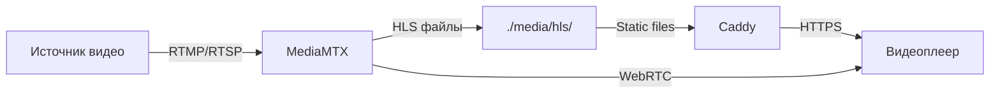

# 📺 Стриминг (MediaMTX)

Руководство по настройке и использованию MediaMTX для стриминга в Adapto Digital TV.

## 📋 Обзор

MediaMTX — это готовый к production медиа-сервер, поддерживающий множество протоколов:

- **RTSP** (Real-Time Streaming Protocol)
- **RTMP** (Real-Time Messaging Protocol)
- **HLS** (HTTP Live Streaming)
- **WebRTC** (Web Real-Time Communication)

---

## 🏗️ Архитектура



### Преимущества схемы

- **Быстрая раздача**: Caddy раздает HLS файлы напрямую (без proxy)
- **Гибкость**: Изменения конфига без перезапуска контейнера
- **Персистентность**: HLS файлы остаются на хосте
- **Масштабируемость**: Легко добавить CDN

---

## 🔧 Конфигурация

### Файл конфигурации

Конфигурация MediaMTX находится в файле `mediamtx.yml` в корне проекта.

```bash
# Редактирование конфигурации
nano mediamtx.yml

# Изменения применяются автоматически!
# Перезапуск контейнера НЕ требуется
```

### Основные параметры

```yaml
# mediamtx.yml

# Логирование
logLevel: info
logDestinations: [stdout]

# RTSP настройки
rtspAddress: :8554
rtspProtocols: [tcp]

# RTMP настройки
rtmpAddress: :1935

# HLS настройки
hlsAddress: :8888
hlsDirectory: /app/media/hls
hlsAlwaysRemux: yes
hlsSegmentCount: 5
hlsSegmentDuration: 1s

# WebRTC настройки
webrtcAddress: :8889
```

---

## 📡 Протоколы и порты

| Протокол | Порт | Формат URL |
|----------|------|------------|
| RTSP | 8554 | `rtsp://host:8554/stream_name` |
| RTMP | 1935 | `rtmp://host:1935/stream_name` |
| HLS | 8888 (внутренний) | `https://host/hls/stream_name/index.m3u8` |
| WebRTC | 8889 | `https://host:8889/stream_name` |

### Production URL

| Протокол | URL |
|----------|-----|
| RTSP | `rtsp://example.com:8554/stream_name` |
| RTMP | `rtmp://example.com:1935/stream_name` |
| HLS | `https://stream.example.com/stream_name/index.m3u8` |
| WebRTC | `https://example.com:8889/stream_name` |

---

## 📁 Структура файлов

```
adapto/
├── mediamtx.yml              # Конфигурация (монтируется в контейнер)
└── media/
    └── hls/                  # HLS сегменты
        ├── stream1/
        │   ├── index.m3u8    # Плейлист
        │   ├── seg0.ts       # Сегмент 0
        │   ├── seg1.ts       # Сегмент 1
        │   └── ...
        └── stream2/
            └── ...
```

### Монтирование volumes

```yaml
# docker-compose.yml
mediamtx:
  volumes:
    - ./mediamtx.yml:/mediamtx.yml:ro    # Конфигурация
    - ./media/hls:/app/media/hls          # HLS файлы

caddy:
  volumes:
    - ./media/hls:/var/www/hls:ro         # Раздача HLS
```

---

## 🚀 Запуск стрима

### Отправка через RTMP

```bash
# FFmpeg
ffmpeg -re -i video.mp4 -c copy -f flv rtmp://example.com:1935/stream_name

# OBS Studio
# Настройки → Вещание → Сервис: Пользовательский
# Сервер: rtmp://example.com:1935
# Ключ потока: stream_name
```

### Отправка через RTSP

```bash
ffmpeg -re -i video.mp4 -c copy -f rtsp rtsp://example.com:8554/stream_name
```

### Проигрывание HLS

```html
<!-- Video.js -->
<video id="player" class="video-js">
  <source src="https://stream.example.com/stream_name/index.m3u8" type="application/x-mpegURL">
</video>

<script>
  videojs('player', {
    techOrder: ['html5'],
    html5: {
      hls: {
        overrideNative: true
      }
    }
  });
</script>
```

---

## 🔐 Аутентификация

### Базовая аутентификация

```yaml
# mediamtx.yml
paths:
  all:
    readUser: viewer
    readPass: viewerpass
    publishUser: publisher
    publishPass: publisherpass
```

### По IP

```yaml
# mediamtx.yml
paths:
  all:
    publishIPs: [192.168.1.0/24, 10.0.0.0/8]
    readIPs: []  # Все могут смотреть
```

---

## 📊 Мониторинг

### API эндпоинты

```bash
# Список путей (стримов)
curl http://localhost:8880/v3/paths/list

# Информация о конкретном стриме
curl http://localhost:8880/v3/paths/get/stream_name

# Конфигурация
curl http://localhost:8880/v3/config/get
```

### Логи

```bash
# Логи MediaMTX
docker compose logs -f mediamtx

# Фильтрация ошибок
docker compose logs mediamtx | grep -i error
```

### Health check

```bash
curl -s http://localhost:8880/v3/paths/list | jq
```

---

## ⚙️ Продвинутая настройка

### Транскодирование на лету

```yaml
# mediamtx.yml
paths:
  transcoded:
    source: rtsp://source:554/stream
    runOnInit: >
      ffmpeg -i rtsp://localhost:$RTSP_PORT/$MTX_PATH
      -c:v libx264 -preset ultrafast
      -c:a aac
      -f rtsp rtsp://localhost:$RTSP_PORT/transcoded_output
```

### Запись стримов

```yaml
# mediamtx.yml
paths:
  recorded:
    record: yes
    recordPath: /recordings/%path/%Y-%m-%d_%H-%M-%S.mp4
    recordFormat: mp4
    recordSegmentDuration: 1h
```

### WebRTC с TURN сервером

```yaml
# mediamtx.yml
webrtcICEServers2:
  - url: turn:turn.example.com:3478
    username: user
    password: pass
```

---

## 🔧 Переменные окружения

```bash
# .env
TZ=Asia/Almaty
MEDIAMTX_WEBRTC_HOSTS=localhost,127.0.0.1,example.com
```

В docker-compose.yml:
```yaml
mediamtx:
  environment:
    - TZ=${TZ:-Asia/Almaty}
    - MTX_RTSPTRANSPORTS=tcp
    - MTX_WEBRTCADDITIONALHOSTS=${MEDIAMTX_WEBRTC_HOSTS:-localhost}
```

---

## 🐛 Решение проблем

### HLS не работает

1. Проверьте что директория существует:
   ```bash
   ls -la media/hls/
   ```

2. Проверьте права доступа:
   ```bash
   chmod -R 755 media/hls/
   ```

3. Проверьте логи:
   ```bash
   docker compose logs mediamtx | grep -i hls
   ```

### WebRTC не подключается

1. Проверьте `MEDIAMTX_WEBRTC_HOSTS` в `.env`
2. Убедитесь что UDP порты открыты (8890, 8189)
3. Проверьте STUN/TURN серверы

### RTMP отклоняется

1. Проверьте firewall на порту 1935
2. Проверьте аутентификацию в `mediamtx.yml`
3. Проверьте логи: `docker compose logs mediamtx | grep rtmp`

---

## 📚 Полезные ссылки

- [MediaMTX GitHub](https://github.com/bluenviron/mediamtx)
- [Документация MediaMTX](https://github.com/bluenviron/mediamtx#documentation)
- [Примеры конфигурации](https://github.com/bluenviron/mediamtx/blob/main/mediamtx.yml)

---

## 🔗 Связанные документы

- [Архитектура](../architecture/OVERVIEW.md)
- [Docker и развёртывание](../setup/DOCKER.md)
- [Хранилище (SeaweedFS)](STORAGE.md)
